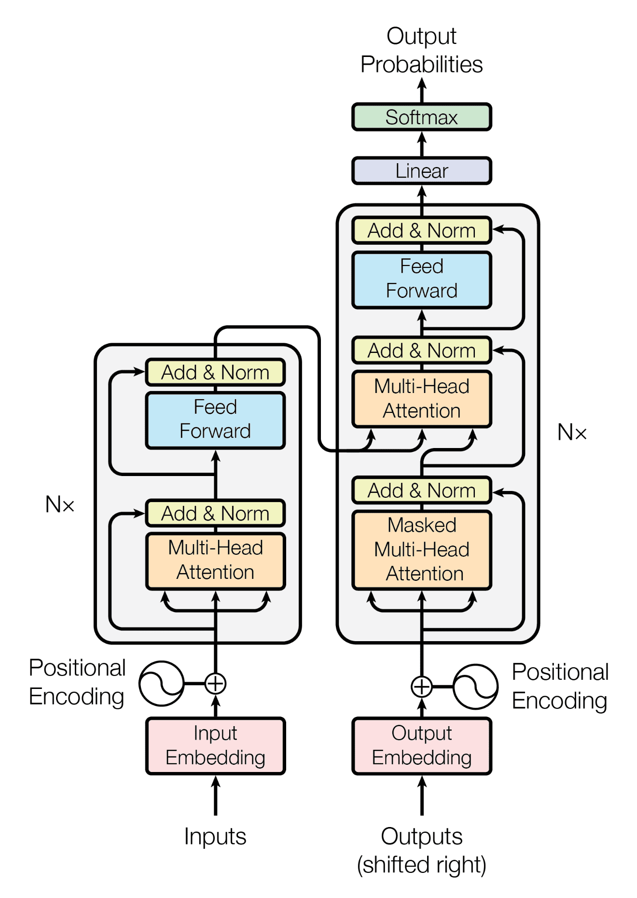
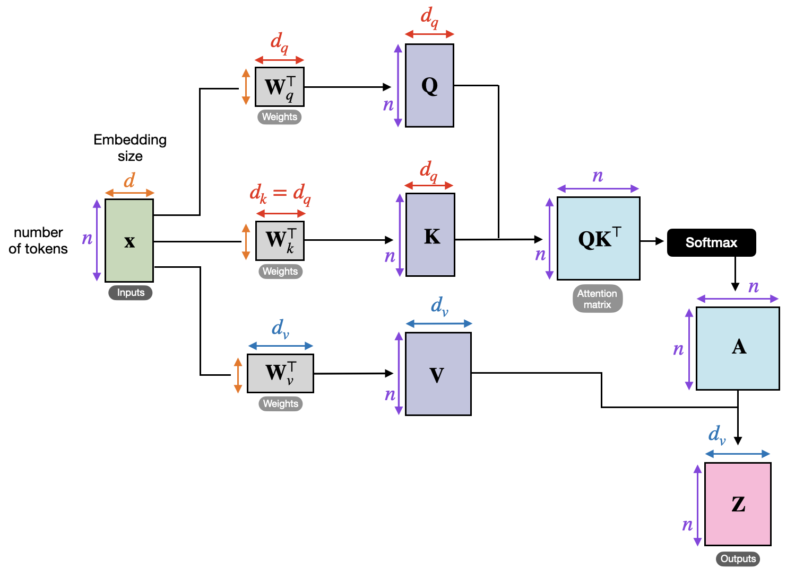

# 🤖💬 My Language Models from Scratch  


  

  
  

## 📝 Project Description  
Welcome to **GPT from Scratch** 🤖💬 !  
The goal of this project is to **implement a Transformer model step by step**, inspired by the architecture behind **GPT (Generative Pre-trained Transformer)**.  

This repository shows how to go from **a simple Bigram model** ➡️ to **a multi-layer Transformer** capable of generating text in French 🇫🇷 and English 🇬🇧 for example.  

---

## ⚙️ Features

This repository contains two different implementations of language models: a **simple Bigram model** and a **full Transformer model**.  

### 🔹 Simple Bigram Model
→ super simple, fast, but no context awareness  

- 🏗️ **Architecture**: Basic bigram model using only an embedding table (`token → vocab_size`)  
- 🎯 **Prediction**: Each token directly predicts the next one via a lookup table  
- 📚 **Dataset**: *Harry Potter* text, character-level encoding  
- ⚙️ **Training**: 10,000 steps with AdamW optimizer (`lr=1e-3`)  
- ⚠️ **Limitation**: No context — each prediction is independent from previous ones  
- ✨ **Generation**: Multinomial sampling over softmax probabilities  


### 🔹 Transformer Model
→ powerful, context-aware, more expensive to train  

- 🏗️ **Architecture**: Transformer with multi-head attention + feed-forward networks  
- 🔑 **Self-Attention**: Key-Query-Value mechanism with causal masking  
- 🧠 **Multi-Head Attention**: 6 parallel heads (`n_head=6`)  
- 📏 **Positional Encoding**: Position embeddings to capture sequential order  
- 🧩 **Transformer Blocks**: 6 layers (`n_layer=6`) with residual connections  
- 🧽 **Normalization**: LayerNorm before each sub-layer  
- 🛡️ **Regularization**: Dropout (`0.2`) to reduce overfitting  
- 📏 **Extended Context**: Block size of `256` tokens vs. `8` in bigram  
- 📚 **Dataset**: Texts of *Victor Hugo*  
- ⚡ **Optimizations**: GPU/CUDA support, periodic train/val loss evaluation  
- 🤖 **Generation**: Context-aware text generation  


## Example Outputs

After just **5,000 iterations**🏋 :
<custom-element data-json="%7B%22type%22%3A%22table-metadata%22%2C%22attributes%22%3A%7B%22title%22%3A%22Exemple%20avec%20d%C3%A9filement%22%7D%7D" />

<custom-element data-json="%7B%22type%22%3A%22table-metadata%22%2C%22attributes%22%3A%7B%22title%22%3A%22Texte%20g%C3%A9n%C3%A9r%C3%A9%20apr%C3%A8s%205%20000%20it%C3%A9rations%22%7D%7D" />

| Description        | Example                                                                                                                                                                                                                                                                                                                                                                                                                                                                                                                                                                                                                                                                                                                                                                                                                                                                                                                                                                                                                                                                                                                                                                                                                                                                                                                                                                                                                                                                                                                                                                                                                                                                                                                                                                                                                                                                                                                                                                                                                                                                                                                                                                                                                                         |
|--------------------|-------------------------------------------------------------------------------------------------------------------------------------------------------------------------------------------------------------------------------------------------------------------------------------------------------------------------------------------------------------------------------------------------------------------------------------------------------------------------------------------------------------------------------------------------------------------------------------------------------------------------------------------------------------------------------------------------------------------------------------------------------------------------------------------------------------------------------------------------------------------------------------------------------------------------------------------------------------------------------------------------------------------------------------------------------------------------------------------------------------------------------------------------------------------------------------------------------------------------------------------------------------------------------------------------------------------------------------------------------------------------------------------------------------------------------------------------------------------------------------------------------------------------------------------------------------------------------------------------------------------------------------------------------------------------------------------------------------------------------------------------------------------------------------------------------------------------------------------------------------------------------------------------------------------------------------------------------------------------------------------------------------------------------------------------------------------------------------------------------------------------------------------------------------------------------------------------------------------------------------------------|
| **Generated Text** | <div style="height: 300px; overflow-y: auto; white-space: pre-wrap;">L'homme a vie Vient pared »<br> Et leurs pas, ébranlant les arches colossales, Troublent les morts couchés sous le pavé des salles.<br> « Oui, nous triomphons ! Venez, sœurs en toutes la foules échoses,<br> D'où fut notre prend notre tout fincens.  Le vent les dérité ! cerf, s'édiffrer leur ma des voix ;<br> Et le parles mourents sourirs le profondée, Mour !<br> Mère du bois ils Dieu la vise ent l'air fait des blancs de mains croisées, Triste, tous entière flots que jour passe ;<br> Il pour leur verra qui son ne ferait cette dans la mière ;<br> Le jour est tête en jour, ils sont là sour ma nombre,<br> Ne velous tra. Qu'on noir mon sangla ! Pierme qu'il nous dans les femmes ?<br> Ils ne s'en vont travailler quinze heures sous dont les tiffles ; Il profond des de l'enfini qui sortes astères,<br> La femme sous luille avec le noir poit.<br> Sans le vers main mauglant, filets attenant ; L'horreur bon est comte le vieille ; L'inge nous pare ; le maître ; leurs mes bleaux ; S'il me vol branche l'amour, regarde, et la nuit.<br> La pauvre montagne homme a Va degrés ! »<br> Le vol plus à cert la porte fix sont qui le partie : La maine se valle, Pour les bouche pritaint en pleint frilleur,<br> Et vous êtes l'homme un flot de l'empire à leur bouille !<br> Qui pourre mon cherveux qui rapportez, dans ce chacun !<br> Par à peine ces deux enfants, couvres Ainsi qu'un pour toute heure ;<br> Parvu qu'il elle, frappe elle lible, Temble, à dérans les coiffres qu'un regarde en tremblant son coeur,<br> Je coupens saint le vert d'enfant mennuit pleur moment.<br> Son bis non sang qu'on chevaiement plus frappé.<br> Car vous êtes pous l'ombre de l'amour même ! Vous êtes l'oasis qu'on le luit mour conde et tout fini.<br> Oui, a regarde et de la petite flamme Son au son aeuil s'aira ces ondeul !<br> Car dans le borouche, âme en pyréche à la mal !<br> Couris à la la penit ses cartant pas, L'ondre effroi de sa démon pable à voix !<br> Si ma triste, S'ai je double qui pleur main et voleur !<br> Il vit, qui fui voulez : Chantez, ples mortes,  Cette foule qui fait ce que mure vous</div> |

**🔍 Preliminary Results:**  
With only 5,000 iterations (~4h GPU 💻🔥), the model starts producing French-like words (though not meaningful sentences yet).

---

## ⚙️ How it works
- 📖 Read a text dataset (Victor Hugo or Harry Potter, multilingual)
- 🔢 Create a mapping between **characters ↔ integers**
- 🧩 Build **encoders/decoders** to switch between text and numbers
- ✂️ Split the dataset into **training (90%)** and **validation (10%)**
- 📦 Process text into **blocks** (context windows) and **batches**
- 🏗️ Implement a **Bigram Language Model**
- 🚀 Train the model using **PyTorch** (`AdamW` optimizer)
- ✨ Generate new text sequences and have fun 😆 !!!

## 🗺️ Schema 
Here you can find the schema of a Transformer Model :


Here is a cool schema I found ! It is a realy clear explanation of the different dimension :


---


## 📂 Repository structure  
```bash
├── img/           # For the README.md
├── text/          # Training corpora (Victor Hugo, Harry Potter, …)
├── Bigram.py      # Bigram model + first experiments  
├── LICENSE
├── README.md
├── Transformer.py # Full Transformer implementation  
```

---
## 💻 Run it on Your PC  
Clone the repository and install dependencies:  
```bash
git clone https://github.com/Thibault-GAREL/Language_Models.git
cd Language_Models
pip install torch
# install with Cuda:
# pip install torch torchvision torchaudio --index-url https://download.pytorch.org/whl/cu118
```

Next, you can use Bigram Model :
```bash
python Bigram.py
```

Or use Transformer Model :
```bash
python Transformer.py
```

---

## 📖 Inspiration / Sources  
This project is based on:  
- 🎥 [Andrej Karpathy – Let's build GPT from scratch](https://www.youtube.com/watch?v=kCc8FmEb1nY)  
- 📄 The scientific paper ["Attention is All You Need"](https://en.wikipedia.org/wiki/Attention_Is_All_You_Need) 
- 🧠 OpenAI’s GPT-2 / GPT-3 and [nanoGPT](https://github.com/karpathy/nanoGPT)  
